# 2.7 通过OCI APM和OpenTelemetry监控OKE (option)


## **前言**

OpenTelemetry 简称为OTel，是一个供应商中立的开源可观测性框架，用于检测、生成、收集和导出遥测数据，例如metrics、traces和logs。本文主要介绍在OKE集群中部署一个Go Demo，并通过OCI的APM和OpenTelemetry对OKE、Go Demo应用进行metrics和traces的收集、展示。

## **部署流程**

- **APM环境准备**
- **OKE集群部署**
- **Helm工具安装**
- **Open Telemetry部署**
- **Go Demo部署到OKE**
- **Logs收集简介**
- **总结**

## **1.1 APM部署**

首先我们要在OCI控制台中部署一套APM，部署步骤详见[APM部署](https://oracle-japan.github.io/ocitutorials/cloud-native/oke-observability-for-advances/#2-3-apm%E3%83%89%E3%83%A1%E3%82%A4%E3%83%B3%E3%81%AE%E4%BD%9C%E6%88%90)。

## **1.2 OKE部署**

其次部署一套OKE集群([OKE部署](https://oracle-japan.github.io/ocitutorials/cloud-native/oke-observability-for-advances/#1-1-oci%E3%83%80%E3%83%83%E3%82%B7%E3%83%A5%E3%83%9C%E3%83%BC%E3%83%89%E3%81%8B%E3%82%89oke%E3%82%AF%E3%83%A9%E3%82%B9%E3%82%BF%E3%81%AE%E6%A7%8B%E7%AF%89))，输入如下命令能正确显示执行结果即可。

```yaml

[root@instance-20230927-1427-tf opc]# kubectl get nodes
NAME        STATUS     ROLES   AGE     VERSION
10.0.3.29   Ready   node    3d14h   v1.25.12
10.0.3.94   Ready   node    3d14h   v1.25.12


```
## **1.3 Helm安装**

我们需要通过helm来安装OpenTelemetry（[helm安装地址](https://helm.sh/docs/intro/install/)）

假设您已经安装了 Helm，请添加 OpenTelemetry Collector Helm charts，以便稍后使用。


```shell
helm repo add open-telemetry https://open-telemetry.github.io/opentelemetry-helm-charts

```

## **1.4 OpenTelemetry安装部署**

OpenTelemetry包含2个很重要的Collector，Daemonset Collector和Deployment Collector

以下介绍他们的作用及安装。

### **1.4.1 Daemonset Collector安装**

它是一个以daemonset形式运行的collector，收集OKE集群内每一个节点上的信息，

它主要包括以下几个组件：

- [OTLP Receiver](https://github.com/open-telemetry/opentelemetry-collector/tree/main/receiver/otlpreceiver):收集应用的 traces, metrics and logs.
- [Kubernetes Attributes Processor](https://opentelemetry.io/docs/kubernetes/collector/components/#kubernetes-attributes-processor):将Kubernetes 元数据添加到传入的application telemetry。
- [Kubeletstats Receiver](https://opentelemetry.io/docs/kubernetes/collector/components/#kubeletstats-receiver): to pull node, pod, and container metrics from the API server on a kubelet。
- [Filelog Receiver](https://opentelemetry.io/docs/kubernetes/collector/components/#filelog-receiver): 收集写入stdout/stderr的Kubernetes日志和应用程序日志。

安装需要一个values.yaml文件，如下所示：

```YAML
mode: daemonset
  
presets:
  # enables the k8sattributesprocessor and adds it to the traces, metrics, and logs pipelines
  kubernetesAttributes:
    enabled: true
  # enables the kubeletstatsreceiver and adds it to the metrics pipelines
  kubeletMetrics:
    enabled: true


config:
  exporters:
    otlphttp:
      endpoint: "https://aaaaddsb2mzmgaaaaaaaaac4i4.apm-agt.us-ashburn-1.oci.oraclecloud.com/20200101/opentelemetry"
      headers:
        Authorization: "dataKey C4FA2HRQLWZXMIF3JP2AGXKRRB7ZCTSF"
  service:
    pipelines:
      metrics:
        exporters: [ otlphttp ]
      traces:
        exporters: [ otlphttp ]


```


<div style="background-color: #ADD8E6; padding: 10px;">
1、配置文件中的endpoint地址和Authorization中的私钥替换成客户真实的信息。

2、Authorization是由 dataKey + 私钥的格式组成。
3、endpoint和私钥地址获取详见：[获取方法](https://oracle-japan.github.io/ocitutorials/cloud-native/oke-observability-for-advances/#2-3-apm%E3%83%89%E3%83%A1%E3%82%A4%E3%83%B3%E3%81%AE%E4%BD%9C%E6%88%90)
</div>

安装命令：

```YAML

helm install otel-collector open-telemetry/opentelemetry-collector --values values.yaml

```


<div style="background-color: #ADD8E6; padding: 10px;">
注意values.yaml文件的路径改为真实路径
</div>


### **1.4.2 Deployment Collector 安装**

该collector是以deployment的形式部署，主要收集整个集群的telemetry，该collector主要包含一下组件：

- [Kubernetes Cluster Receiver](https://opentelemetry.io/docs/kubernetes/collector/components/#kubernetes-cluster-receiver): 收集整个集群的metrics和entity events.
- [Kubernetes Objects Receiver](https://opentelemetry.io/docs/kubernetes/collector/components/#kubernetes-objects-receiver): 从Kubernetes API server收集objects。

安装同样需要一个values-cluster.yaml（名称是为了和上面的values.yaml区分），如下所示：

```YAML
mode: deployment
  
# We only want one of these collectors - any more and we'd produce duplicate data
replicaCount: 1

presets:
  # enables the k8sclusterreceiver and adds it to the metrics pipelines
  clusterMetrics:
    enabled: true
  # enables the k8sobjectsreceiver to collect events only and adds it to the logs pipelines
  kubernetesEvents:
    enabled: true
## The chart only includes the loggingexporter by default
## If you want to send your data somewhere you need to
## configure an exporter, such as the otlpexporter
config:
  exporters:
   otlphttp:
     endpoint: "https://aaaaddsb2mzmgaaaaaaaaac4i4.apm-agt.us-ashburn-1.oci.oraclecloud.com/20200101/opentelemetry"
     headers:
        Authorization: "dataKey C4FA2HRQLWZXMIF3JP2AGXKRRB7ZCTSF"
  service:
    pipelines:
      metrics:
        exporters: [ otlphttp ]
      traces:
        exporters: [ otlphttp ]

```

<div style="background-color: #ADD8E6; padding: 10px;">
1、配置文件中的endpoint地址和Authorization中的私钥替换成客户真实的信息。

2、Authorization是由 dataKey + 私钥的格式组成。
3、endpoint和私钥地址获取详见：[获取方法](https://oracle-japan.github.io/ocitutorials/cloud-native/oke-observability-for-advances/#2-3-apm%E3%83%89%E3%83%A1%E3%82%A4%E3%83%B3%E3%81%AE%E4%BD%9C%E6%88%90)
</div>

安装命令：

```YAML

helm install otel-collector-cluster open-telemetry/opentelemetry-collector --values values-cluster.yaml

```

检查结果：

```YAML
[root@instance-20230927-1427-tf opentelemetry]# kubectl get pod|grep otel
otel-collector-cluster-opentelemetry-collector-6f68f78f9c-2qsjn   1/1     Running   1              2d
otel-collector-opentelemetry-collector-agent-zthfv                1/1     Running   1              2d1h
```
可以看到2个pod已经正常运行。这时metrics数据已经开始正常的上传到OC Monitoring中

登录OCI Monitoring的Metrics Explorer服务查看pod metrics信息

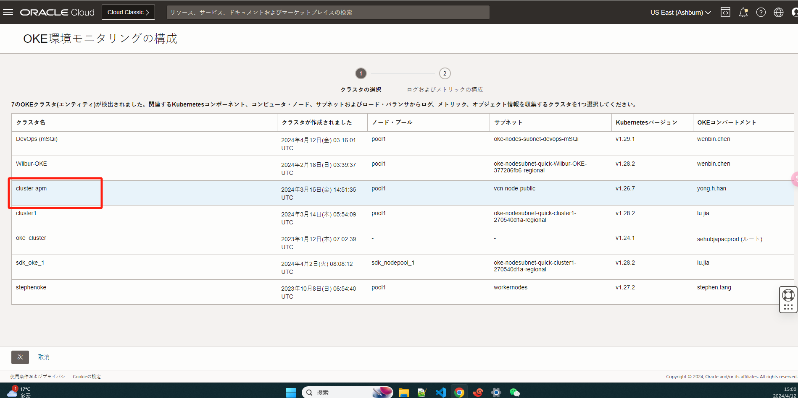
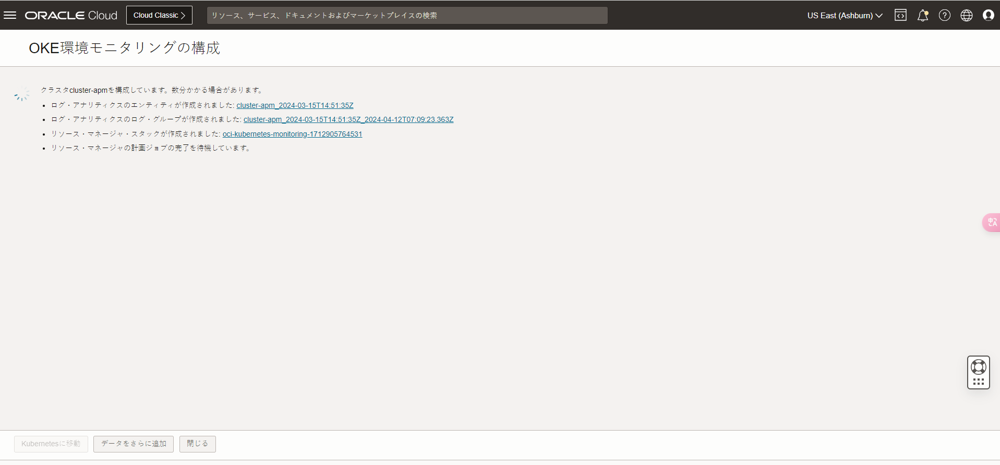


<div style="background-color: #ADD8E6; padding: 10px;">
注意：选择正确的compartment及其他选项，namespace请选择oracle-apm-monitoring
</div>


至此metrics的配置、收集已完毕，下面我们部署一个Go语言Demo到OKE中。

## **1.5 GO DEMO部署**

以https://github.com/oracle-japan/ochacafe-faststart-go
为例，部署到OKE中。此代码已进行了改造，将跟踪数据导出到了OCI的API端点。


首先配置 **PostgreSQL，参考：[PG配置](https://qiita.com/yama6/items/ec8cd7652a1c0cf9e13d#3-oci-database-with-postgresql%E3%81%AE%E4%BD%9C%E6%88%90)**，**记录其中的endpoint、username、password**

等待部署完毕后登录PG库,登录pg命令：
```YAML
psql -h <endpoint> -U <usename> -d postgres
```
创建demo数据库：
```YAML
postgres=> create database demo;
```

数据库创建完毕后使用kubectl命令分别创建db secret 和apm secret，供k8s 部署文件引用。

```YAML

kubectl create secret generic db-secret --from-literal=username=admin --from-literal=password=Kubectl0319@ --from-literal=host=10.0.1.28

```
username、password 为pg的用户名和密码，host为pg的ip地址

```YAML
kubectl create secret generic apm-secret --from-literal=endpoint=https://aaaaddsb2mzmgaaaaaaaaac4i4.apm-agt.us-ashburn-1.oci.oraclecloud.com --from-literal=key=C4FA2HRQLWZXMIF3JP2AGXKRRB7ZCTSF

```
endpoint、key为APM的endpoint和私钥

应用部署，使用上述go demo中的app.yaml进行部署https://github.com/oracle-japan/ochacafe-faststart-go/blob/main/k8s/app.yaml

```YAML
kubectl apply -f app.yaml
```

等待片刻获取Service EXTERNAL-IP 的ip地址

```YAML

[root@instance-20230927-1427-tf opentelemetry]# kubectl get svc golang-demo-lb

NAME            TYPE         CLUSTER-IP     EXTERNAL-IP     PORT(S)     AGE

golang-demo-lb LoadBalancer 10.96.24.160 150.230.161.35   80:32344/TCP   10m

```

在浏览器中输入http://150.230.161.35，进行测试


多刷新几次去OCI的APM中查看traces信息
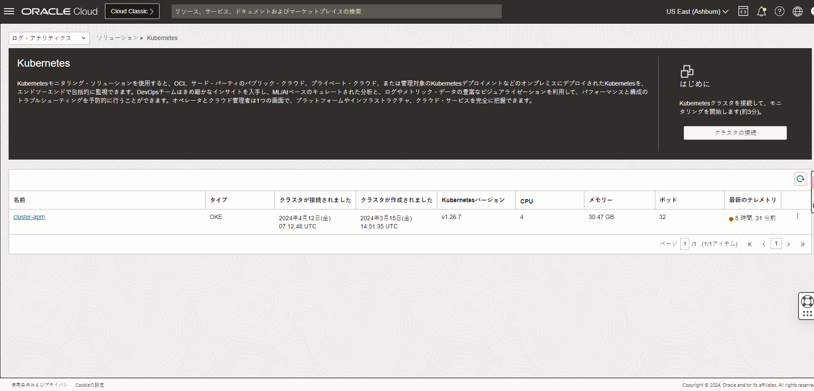
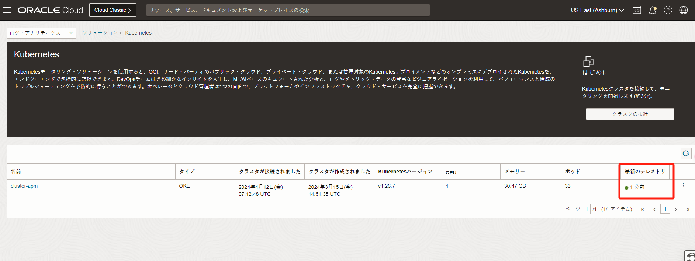

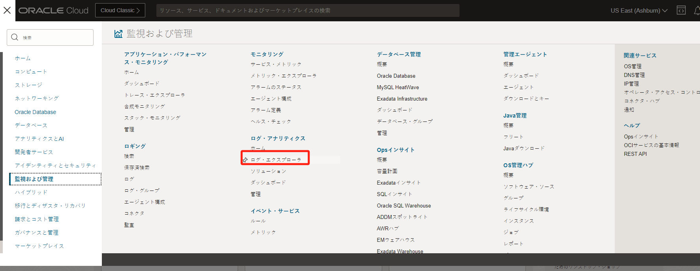
***集中观测***：

目前metrics和traces数据分别在Monitoring和APM两个服务中查看，为了方便统一监控，可以在APM的Dashboards中自定义监控大盘数据。
如下图所示，选择Create Dashboard，选择Widgets并新增
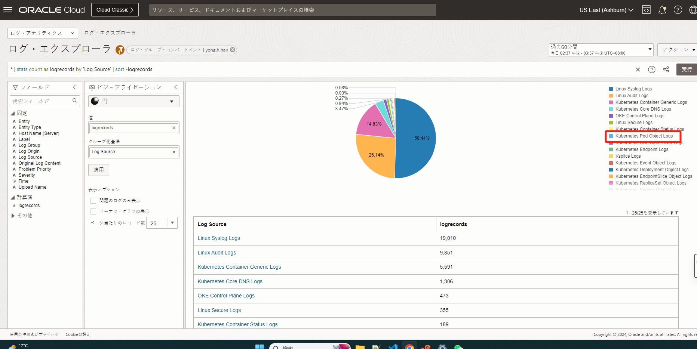


点击"+"，添加数据，并在Namespace中选择oracle-apm-monitoring
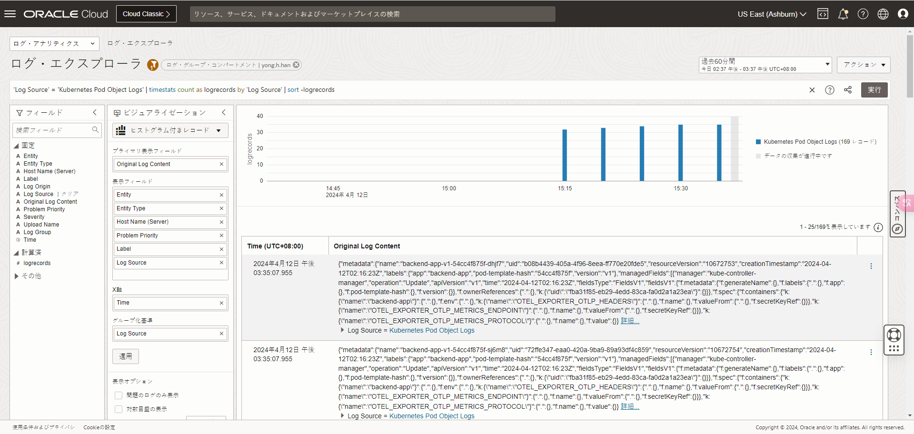
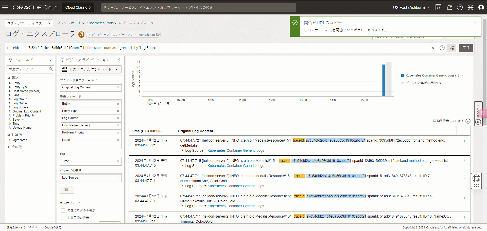

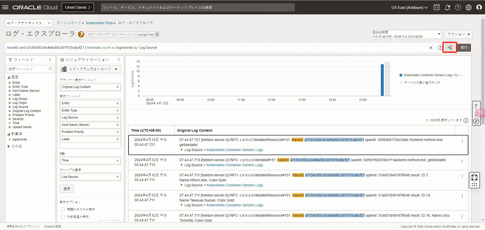
将左侧所需要的metrics拖动到右侧的"Y axis"，点击Apply


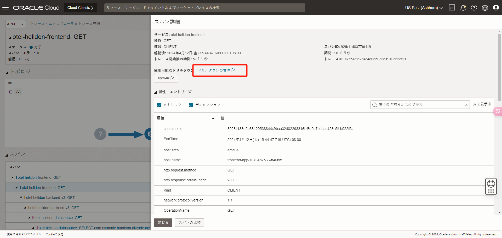

添加traces数据可重复上述步骤，并在APM Widgets中选择对应的选项，如下图所示

可以在同一个界面显示metrics和traces数据
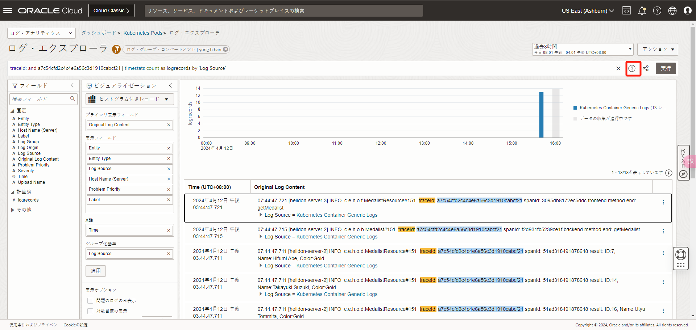
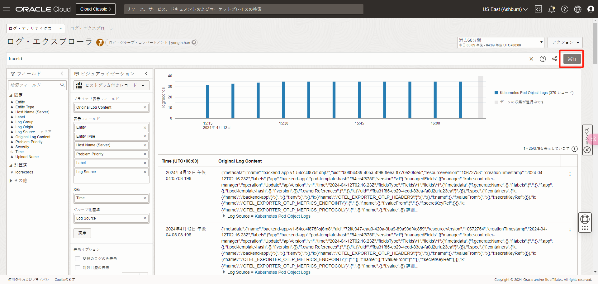


## **1.6 logs收集**

本文主要讲解metrics和traces的收集，logs收集详见[OCI Logging服务](https://oracle-japan.github.io/ocitutorials/cloud-native/oke-observability-for-advances/#3logging)

## **总结：**

以上就是通过OCI的APM和开源的Opentelemetry对OKE集群进行统一监控的部署全过程。OCI APM提供完整的应用链路监控，并且提供多种监控大盘模板，极大的帮助客户减少故障诊断时间，更多内容请大家自行体验，谢谢。