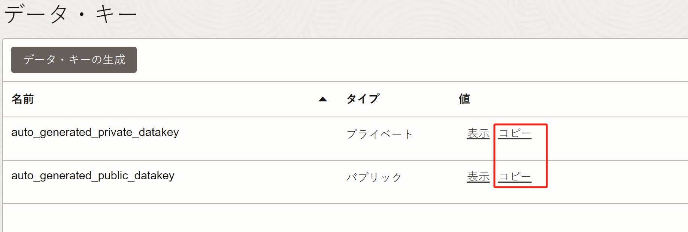
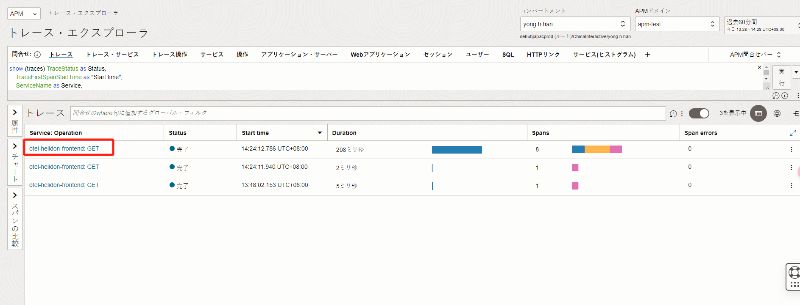
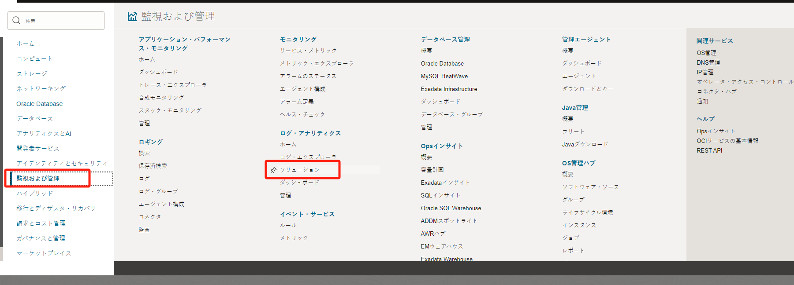
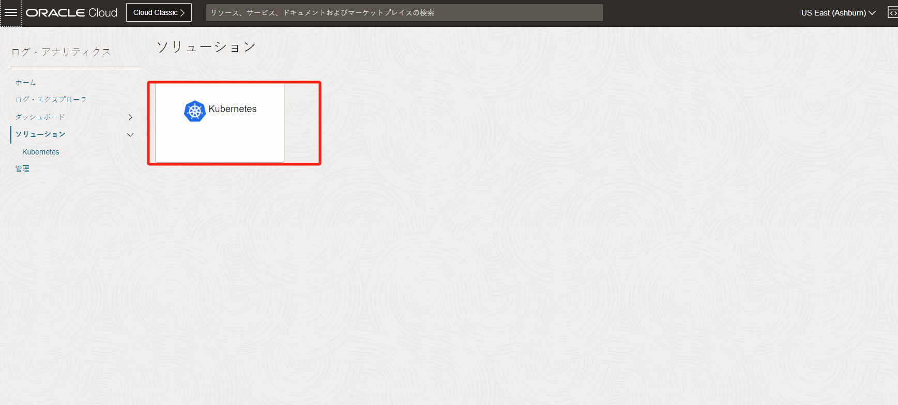
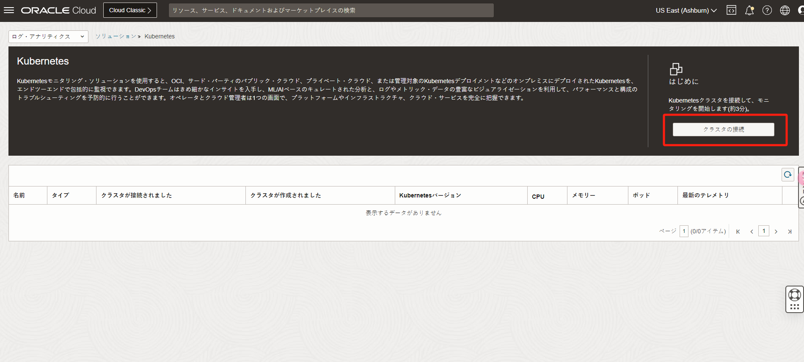
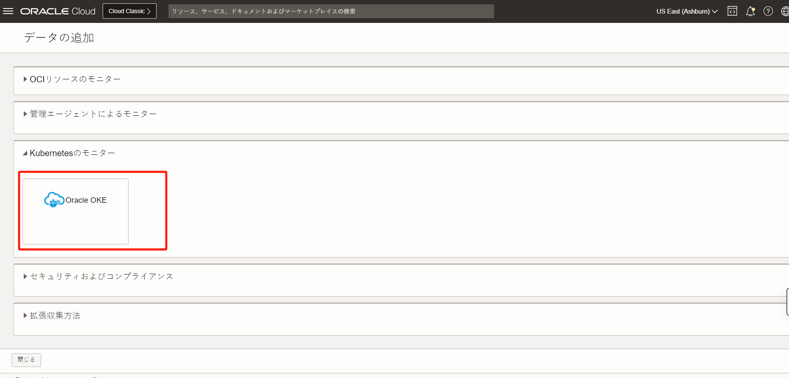

#  通过OCI APM和Logging Analytics监控OKE中的Java微服务


## **前言**

本场景介绍如何将集成了Open Telemetry的JAVA微服务部署到OKE环境中，并且通过OCI的APM和Logging Analytics收集OKE集群的traces和logs。最后使用Drilldowns关联APM和Logging Analytics。

## **部署流程**

- **APM环境准备**
- **OKE集群部署**
- **JAVA微服务部署**
- **Logging Analytics收集OKE日志**
- **使用Drilldowns关联APM和Logging Analytics**
  

## **APM环境准备**

首先我们要在OCI控制台中部署一套APM，部署步骤详见[APM部署](https://oracle-japan.github.io/ocitutorials/cloud-native/oke-observability-for-advances/#2-3-apm%E3%83%89%E3%83%A1%E3%82%A4%E3%83%B3%E3%81%AE%E4%BD%9C%E6%88%90)。
记录其endpoint和datakey，如下图所示：



## **OKE集群部署**

其次部署一套OKE集群([OKE部署](https://oracle-japan.github.io/ocitutorials/cloud-native/oke-observability-for-advances/#1-1-oci%E3%83%80%E3%83%83%E3%82%B7%E3%83%A5%E3%83%9C%E3%83%BC%E3%83%89%E3%81%8B%E3%82%89oke%E3%82%AF%E3%83%A9%E3%82%B9%E3%82%BF%E3%81%AE%E6%A7%8B%E7%AF%89))，输入如下命令能正确显示执行结果即可。

```yaml

[root@instance-20230927-1427-tf opc]# kubectl get nodes
NAME        STATUS     ROLES   AGE     VERSION
10.0.3.29   Ready   node    3d14h   v1.25.12
10.0.3.94   Ready   node    3d14h   v1.25.12


```
## **JAVA微服务部署**

本次部署示例地址：https://github.com/oracle-japan/code-at-customer-handson-otelVer/tree/main/ 下载到本地。


```shell
[root@instance-20230927-1427-tf tmp]# git clone https://github.com/oracle-japan/code-at-customer-handson-otelVer.git
Cloning into 'code-at-customer-handson-otelVer'...
remote: Enumerating objects: 7911, done.
remote: Counting objects: 100% (5416/5416), done.
remote: Compressing objects: 100% (3064/3064), done.
remote: Total 7911 (delta 2051), reused 5387 (delta 2047), pack-reused 2495
Receiving objects: 100% (7911/7911), 81.83 MiB | 52.57 MiB/s, done.
Resolving deltas: 100% (3261/3261), done.

```

部署应用前需要创建一个apm-secret，供k8s 部署文件引用。命令如下：

```shell
[root@instance-20230927-1427-tf k8s]# kubectl create secret generic apm-secret --from-literal=traces-endpoint="https://aaaaddsb2mzmgaaaaaaaaac4i4.apm-agt.us-ashburn-1.oci.oraclecloud.com/20200101/opentelemetry/private/v1/traces/" --from-literal=metrics-endpoint="https://aaaaddsb2mzmgaaaaaaaaac4i4.apm-agt.us-ashburn-1.oci.oraclecloud.com/20200101/opentelemetry/v1/metrics" --from-literal=private-key-header="authorization=dataKey C4FA2HRQLWZXMIF3JP2AGXKRRB7ZCTSF"
secret/apm-secret created

[root@instance-20230927-1427-tf k8s]# kubectl get secret
NAME                                           TYPE                 DATA   AGE
apm-secret                                     Opaque               3      11s
db-secret                                      Opaque               3      27d
sh.helm.release.v1.otel-collector-cluster.v1   helm.sh/release.v1   1      19h
sh.helm.release.v1.otel-collector.v1           helm.sh/release.v1   1      19h

```

<div style="background-color: #ADD8E6; padding: 10px;">
注意：

1、上面的endpoint地址需要加上/20200101/opentelemetry/private/v1/traces/、/20200101/opentelemetry/v1/metrics" 后缀。

2、private-key-header中的key为private_datakey
</div>

应用部署，进入目录：/code-at-customer-handson-otelVer/k8s，部署backend、frontend、datasource

```YAML
[root@instance-20230927-1427-tf k8s]# kubectl apply -f olympic_backend.yaml
deployment.apps/backend-app-v1 created
deployment.apps/backend-app-v2 created
deployment.apps/backend-app-v3 created
service/backend-app created
[root@instance-20230927-1427-tf k8s]# kubectl apply -f olympic_frontend.yaml 
deployment.apps/frontend-app created
service/frontend-app created
[root@instance-20230927-1427-tf k8s]# kubectl apply -f olympic_datasource.yaml 
deployment.apps/datasource-app created
service/datasource-app created

```

等待片刻获取Service EXTERNAL-IP 的地址

```YAML
[root@instance-20230927-1427-tf k8s]# k get svc frontend-app
NAME           TYPE           CLUSTER-IP    EXTERNAL-IP     PORT(S)        AGE
frontend-app   LoadBalancer   10.96.6.146   129.213.197.0   80:30287/TCP   104s

```

在浏览器中输入http://129.213.197.0/ ,多次刷新页面，进行测试。


在OCI控制台的APM中查看traces信息。




如上图所示，可以正常显示访问的整体traces路径


## **Logging Analytics收集OKE日志**
接下来部署Logging Analytics收集OKE集群中的日志。



如下图所示进入对应菜单。





选择所需的OKE集群


选择Configure

<div style="background-color: #ADD8E6; padding: 10px;">
注意：
本次操作会自动增加dynamic group and policies，其中有一条policies"Allow dynamic-group <dynamic_group_name> to {LOG_ANALYTICS_DISCOVERY_UPLOAD} in tenancy"，需要具有管理员权限,否则操作会失败。</div>


等待部署完毕，跳转到状态查询


等待5分钟，状态按钮变成绿色


验证日志收集是否正常。


选择右侧过滤pod日志


可以看到OKE的日志已经被收集到Logging Analytics中


## **使用Drilldowns关联APM和Logging Analytics**
OpenTelemetry 在日志中记录了traceid和spanid，这允许直接关联对应请求的traces和logs。OCI APM提供了一种简单的方法，使用Drilldowns配置，只需单击一下即可从traces导航到 OCI Logging Analytics中的日志。

在Logging Analytics中输入：traceId，点击运行。


复制任意一条记录，如下图格式所示


粘贴复制内容到搜索框，先点击运行，然后在点击复制URL


URL的格式如下：
https://cloud.oracle.com/loganalytics/explorer?viz=records_histogram&encodedQuery=dHJhY2VJZDogYW5kIGE3YzU0Y2ZkMmM0YzRlNmE1NmMzZDE5MTBjYWJjZjIxIHwgdGltZXN0YXRzIGNvdW50IGFzIGxvZ3JlY29yZHMgYnkgJ0xvZyBTb3VyY2Un&vizOptions=%7B%22customVizOpt%22%3A%7B%22primaryFieldIname%22%3A%22mbody%22%2C%22primaryFieldDname%22%3A%22Original%20Log%20Content%22%7D%7D&scopeFilters=lg%3Aocid1.compartment.oc1..aaaaaaaaptdr4gr5mfj72ywuwpegdykybsit2vrk4tkgfuye7rhk7y7efrjq%2Ctrue%3Brs%3Aocid1.compartment.oc1..aaaaaaaaptdr4gr5mfj72ywuwpegdykybsit2vrk4tkgfuye7rhk7y7efrjq%2Ctrue%3Brg%3Aus-ashburn-1&timeNum=60&timeUnit=MINUTES&region=us-ashburn-1&tenant=sehubjapacprod

URL需要做一定的修改：其中的encodedQuery=******************修改为search=traceId: and <traceid>

新URL如下，将其复制到APM Drilldowns的配置中：

https://cloud.oracle.com/loganalytics/explorer?viz=records_histogram&search=traceId: and <traceid>&vizOptions=%7B%22customVizOpt%22%3A%7B%22primaryFieldIname%22%3A%22mbody%22%2C%22primaryFieldDname%22%3A%22Original%20Log%20Content%22%7D%7D&scopeFilters=lg%3Aocid1.compartment.oc1..aaaaaaaaptdr4gr5mfj72ywuwpegdykybsit2vrk4tkgfuye7rhk7y7efrjq%2Ctrue%3Brs%3Aocid1.compartment.oc1..aaaaaaaaptdr4gr5mfj72ywuwpegdykybsit2vrk4tkgfuye7rhk7y7efrjq%2Ctrue%3Brg%3Aus-ashburn-1&timeNum=60&timeUnit=MINUTES&region=us-ashburn-1&tenant=sehubjapacprod


导航到APM中，选择一条有效的traces记录，点击ドリルダウンの管理


粘贴上述的URL到对话框中，注意红框标注的修改部分


配置完毕后，我们在APM中选择一条新的trace记录


会携带新的traceid到Logging Analytics中（traceid:06637fc3d1a031c628c682450edd7501）


以上就是整体安装步骤。